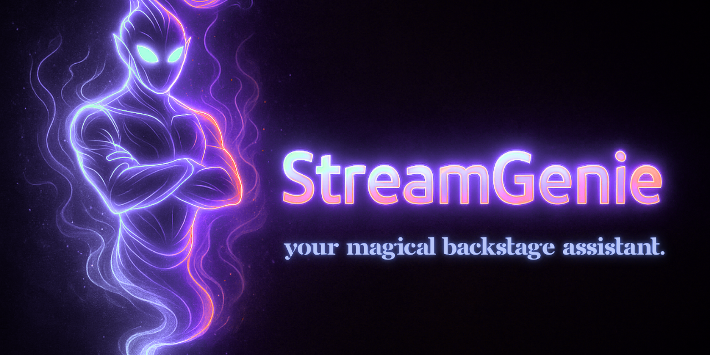

# 🧞‍♂️ **StreamGenie**
<p align="center">
  
</p>

### *Your magical backstage assistant for livestreams.*

A production-ready automation system that grants your stream’s every wish — queue syncing, chat lookups, overlay updates, and one-button control.  
Designed for creators. Built for developers.  
Showcase-ready as an engineering portfolio piece.

---

# ⭐ 1. The Story — *From Chaos to Magic*

Picture this:

You’re hosting a high-energy livestream — Q&A, coaching, workshop, AMA, gameplay help, live reviews, whatever your community loves.

The viewers are pumped.  
The questions flood in.  
The queue gets longer by the second.

And suddenly…

- Your Google Form is exploding  
- Chat keeps asking “Where am I in line?”  
- Overlays fall out of sync  
- You’re bouncing between tabs  
- Momentum slips  
- You feel overwhelmed  

Your audience feels confused.  
Your flow evaporates in real time.

### ✨ Then StreamGenie arrives.

What if all that overhead disappeared?

What if you could:

- Tap **one button** to advance the queue  
- Have your overlays update instantly  
- Let viewers check `!queue`, `!spot`, and `!wait` with perfect accuracy  
- Trigger first-timer animations automatically  
- Keep your show flowing without fighting spreadsheets  

**That’s StreamGenie.**

A magical backstage assistant that handles the invisible work —  
so *you* can stay present, connected, and in flow.

---

# ⭐ 2. Quick Technical Overview

**Purpose**  
A modular automation engine for queue-driven livestreams.

**Core Components**

| Layer            | Technology                  | Role                                 |
| ---------------- | --------------------------- | ------------------------------------ |
| **GenieCore**    | Google Sheets + Apps Script | Queue logic, API endpoints           |
| **GenieChat**    | Nightbot                    | Viewer-facing commands               |
| **GenieTrigger** | PowerShell                  | Overlay updates, API calls           |
| **GenieCast**    | OBS + WebSocket v5          | On-screen visuals                    |
| Optional         | Stream Deck                 | One-button “summon the genie” action |

**Highlights**

- Real-time queue status for viewers  
- Automatic OBS overlay syncing  
- Magical “First Timer” animations  
- No dedicated servers or hosting required  
- Modular & extensible (dashboard, analytics, multi-queue, etc.)  

**Ideal For**

- Q&A marathons  
- Coaching and consulting streams  
- One-on-one session queues  
- Live workshops and classes  
- AMA events  
- Community learning sessions  
- Charity streamathons  

For deeper detail, see the docs:

- `docs/architecture.md` — Architecture overview & data flow  
- `docs/streamer-setup-guide.md` — Streamer-focused setup guide  
- `docs/developer-guide.md` — Developer-oriented implementation notes  
- `docs/api-reference.md` — HTTP API reference for GenieCore  

---

# ⭐ 3. For Streamers — *Explain It Like I’m 11*

StreamGenie is like having a tiny magical helper behind the scenes.

If you can follow LEGO instructions, you can install this.

## 🧞 Step 1 — Make the Google Form

Ask for:

- Name  
- Email or phone  
- Their question / request  

Google will create a Sheet — this is your **GenieCore** queue.

---

## 🧞 Step 2 — Add the Code to Google Sheets

1. Open the linked Google Sheet.  
2. Go to **Extensions → Apps Script**.  
3. Delete everything.  
4. Open `apps_script/Code.gs` from this repo and paste it in.  
5. At the top, set your Sheet ID + tab name.  
6. Deploy as a **web app**.  
7. Set:
   - **Execute as:** Me  
   - **Who has access:** Anyone  
8. Copy your deployment URL — this is your **Magic URL**.

This is the single URL all other pieces talk to.

---

## 🧞 Step 3 — Add Your Nightbot Commands (GenieChat)

1. Open Nightbot in your browser.  
2. Go to **Custom Commands**.  
3. Open `nightbot/commands.md` from this repo.  
4. For each command (e.g. `!queue`, `!wait`, `!spot`):
   - Copy the command definition.  
   - Replace `YOUR_WEB_APP_URL` with your Magic URL.  

Your viewers now get:

- `!queue` — how long is the line?  
- `!wait` — what’s the approximate wait?  
- `!spot 1234` — where am *I* in the queue?  

Instant answers. Consistent accuracy.

---

## 🧞 Step 4 — Set Up OBS Overlays (GenieCast)

1. Install **obs-websocket v5** (if you haven’t already).  
2. In your project folder, ensure there is an `overlays/` directory.  
3. In OBS, create three **Text** sources that read from files:
   - `overlays/now_active.txt`  
   - `overlays/up_next.txt`  
   - `overlays/session_count.txt`  
4. Create a **Group** in OBS called **GenieToast** and design whatever “first-timer” animation or frame you want there.  
5. Follow `obs/SETUP.md` for precise names and configuration.

Your overlays are now fully enchanted — they update *without you touching a thing* whenever the queue advances.

---

## 🧞 Step 5 — Summon the Genie (GenieTrigger)

The automation is controlled by a PowerShell script that talks to GenieCore and updates your overlays.

- Basic usage: double-click:

  ```bat
  nextSession.bat
  ```

  This will:
  - Advance the queue  
  - Update all overlay text files  
  - Trigger the “First Timer” toast (if the new person is a first-timer)  

- Optional: map `nextSession.bat` to a **Stream Deck** button for true one-tap magic.

Once this is wired up, finishing a session is as simple as pressing a single button.

---

# ⭐ 4. Quickstart — Developers

Clone the repo locally:

```bash
git clone https://github.com/moses-shenassa/interactive-streaming-queue-automation.git
cd interactive-streaming-queue-automation
```

Explore the structure:

```text
apps_script/          # GenieCore: Apps Script backend
nightbot/             # GenieChat: Nightbot command templates
obs/                  # GenieCast: OBS setup notes
overlays/             # Text files OBS reads from
powershell/           # GenieTrigger: automation scripts
docs/                 # Architecture, API, streamer & dev guides
nextSession.bat       # One-click queue advance helper
```

No extra package installation is required to understand the system.  
To actually run it, you’ll need:

- A Google account (for Forms + Sheets + Apps Script)  
- OBS with obs-websocket v5  
- Nightbot connected to your streaming platform  
- PowerShell (built into Windows)  

See `docs/developer-guide.md` for a more thorough developer-oriented walkthrough.

---

# ⭐ 5. Integration & Runtime Flow

## 🧞 Chat (GenieChat)

Nightbot hits the StreamGenie API via `$(urlfetch ...)`:

```text
?queue=1
?spot=$(query)
?wait=1
```

Each of these is wired in `nightbot/commands.md` and is safe to paste directly into Nightbot with only one edit: your Magic URL.

---

## 🧞 OBS (GenieCast)

OBS reads from the text files generated by `powershell/update_overlays.ps1`:

- `overlays/now_active.txt`  
- `overlays/up_next.txt`  
- `overlays/session_count.txt`  

When the script runs, these files update; OBS reflects the changes instantly on stream.

---

## 🧞 Queue Advancement (GenieTrigger)

Basic:

```bat
nextSession.bat
```

Advanced (calling the script directly):

```powershell
powershell -ExecutionPolicy Bypass -File .\powershell\update_overlays.ps1 -Advance
```

This keeps your stream’s **flow rhythm** intact: one action, full system update.

---

# ⭐ 6. For Developers — Deep Technical Tour

StreamGenie is designed as a **serverless orchestration engine** with predictable flows and idempotent state transitions.

It uses:

- **Google Apps Script** (`apps_script/Code.gs`) as a lightweight HTTP API over Sheets  
- **Google Sheets** as the canonical state store for the queue  
- **Nightbot** as the chat integration layer  
- **PowerShell** as the automation and integration glue  
- **OBS WebSocket v5** as the bridge into on-stream visuals  

## 🧱 Architecture Diagram

```text
                          Viewers
                 (Twitch / YouTube / other)
                              |
                        !queue / !spot
                              |
                              v
                          Nightbot
                 (urlfetch → GenieCore API)
                              |
                              v
                     Google Apps Script
              ┌──────────────────────────────┐
              │ Reads & computes queue state │
              │ Endpoints:                   │
              │   ?queue=1                   │
              │   ?spot=x                    │
              │   ?next=1                    │
              └──────────────┬───────────────┘
                             |
          ┌──────────────────┴─────────────────┐
          v                                     v
  Nightbot reply                      PowerShell (GenieTrigger)
                                   writes .txt → OBS sources
                                                |
                                                v
                                     OBS via WebSocket
                                                |
                                                v
                                        On-stream UI
```

## 🧠 Engineering Highlights

- **Idempotent operations** — calling `?next=1` is safe to retry if something hiccups.  
- **No external hosting** — Apps Script is the “server,” Google Sheets is the database.  
- **Human-editable data source** — the queue is visible and modifiable in a spreadsheet.  
- **File-based IPC** — overlays use simple text files, easy to debug and override.  
- **Strictly defined state transitions** — queue updates are funneled through a single, controlled path.  
- **Extension-friendly architecture** — easy to add dashboards, bots, analytics, or multi-queue support.

For a deeper dive, see:

- `docs/architecture.md`  
- `docs/developer-guide.md`  
- `docs/api-reference.md`  

---

# ⭐ 7. About the Author

This project was designed and implemented by **Moses Shenassa** as part of a broader focus on:

- Real-time systems for creators and communities  
- Automation of operational overhead for live events  
- Clear, human-centered engineering for non-technical users  

**Links (fill these in as appropriate):**

- Website: *[your site here]*  
- LinkedIn: *[your LinkedIn here]*  
- Email: *[your preferred contact]*  

Feel free to reach out if you’d like help customizing StreamGenie for your own production workflows.

---

# ⭐ 8. License

MIT © 2025 — StreamGenie • Moses Shenassa
